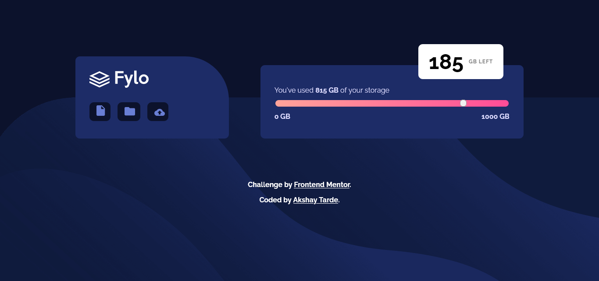
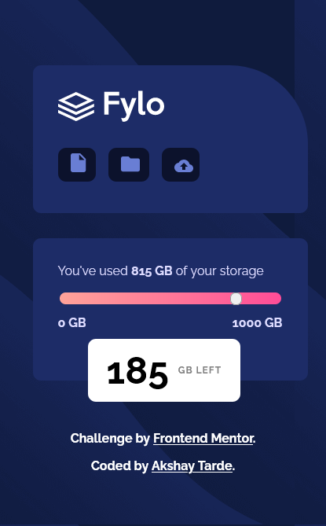

# Frontend Mentor - Fylo data storage component solution

This is a solution to the [Fylo data storage component challenge on Frontend Mentor](https://www.frontendmentor.io/challenges/fylo-data-storage-component-1dZPRbV5n). Frontend Mentor challenges help you improve your coding skills by building realistic projects. 

## Table of contents

- [Overview](#overview)
  - [The challenge](#the-challenge)
  - [Screenshot](#screenshot)
  - [Links](#links)
- [My process](#my-process)
  - [Built with](#built-with)
  - [What I learned](#what-i-learned)
  - [Continued development](#continued-development)
- [Author](#author)

## Overview

### The challenge

Users should be able to:

- View the optimal layout for the site depending on their device's screen size

### Screenshot

Desktop Layout

Mobile Layout

### Links

- Solution URL: [Frontend Mentor](https://www.frontendmentor.io/solutions/fylo-data-storage-component-fsvC0xYMsu)
- Live Site URL: [Netlify URL](https://fylo-data-storage-component-amt.netlify.app/)

## My process
I styled the components with flexbox and grid. 
I used the position property to style the floating card. 
### Built with

- Semantic HTML5 markup
- CSS custom properties
- Flexbox
- CSS Grid
- Mobile-first workflow

### What I learned
I learned a lot about styling input range HTML element. 

### Continued development

I need to add to make sure the gradient on the range slider does not go beyond the slider button.
I have to style the floating card to have the pointy end in the desktop layout.

## Author

- Frontend Mentor - [@Akshay-Tarde](https://www.frontendmentor.io/profile/Akshay-Tarde)
